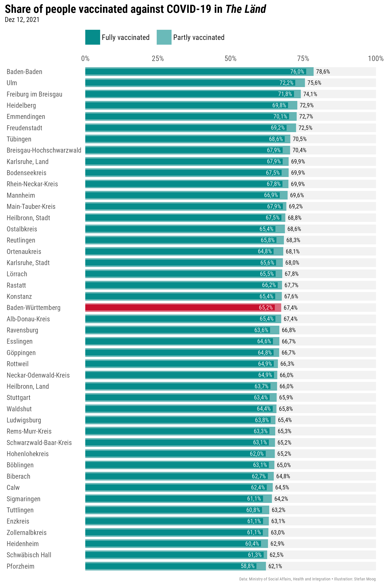
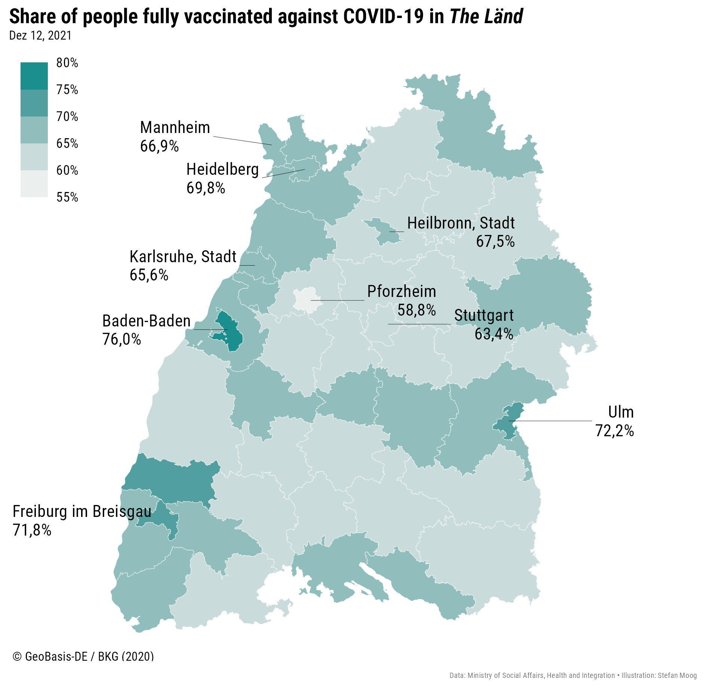

<!-- README.md is generated from README.Rmd. Please edit that file -->

# covidbw

This is a personal repository which starting on Nov 14, 2021 provides a
collection of data on the state of vaccination against COVID-19 in the
German federal state of Baden-Wuerttemberg or as it is called: “The
Länd”.

# Data

-   The repository provides data on people partly or fully vaccinated in
    the counties of the Länd as CSV files by date of publication.

-   Additionally the repository contains a collection of the raw PDFs
    from which the data is extracted and which are published by the
    [Ministry of Social Affairs, Health and
    Integration](https://sozialministerium.baden-wuerttemberg.de). The
    most recent PDF containing a table of the number and the share of
    people vaccinated against COVID-19 could be downloaded from
    [here](https://sozialministerium.baden-wuerttemberg.de/fileadmin/redaktion/m-sm/intern/downloads/Downloads_Gesundheitsschutz/Corona_Gesamtzahl-Impfungen-Landkreise-BW.pdf).

# Data Visualization

Besides the data the repository contains some visualitions made in the
[R programming language](https://www.r-project.org) using the data viz
package [ggplot2](https://ggplot2.tidyverse.org).

An [interactive map](https://www.datawrapper.de/_/x5nV3/) created with
[Datawrapper](https://www.datawrapper.de) could be found
[here](https://www.datawrapper.de/_/x5nV3/).
